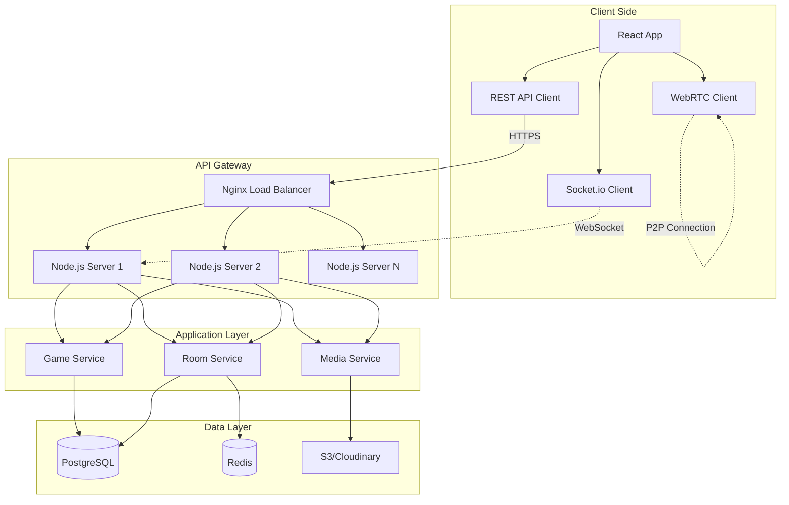

# PuzzleChat System Design Document

## 1. System Components Flow



## 2. Key Design Decisions

### 2.1 Technology Choices

| Component | Technology | Rationale |
|-----------|------------|-----------|
| Frontend | Next.js 14 + TypeScript | SSR/SSG, built-in optimizations, API routes, image optimization |
| State Management | Zustand + React Query | Lightweight, TypeScript support, server state caching |
| Real-time | Socket.io | Reliable WebSocket with fallbacks, room support |
| Video/Audio | WebRTC | P2P connections reduce server load |
| Backend | Node.js + Express | JavaScript everywhere, excellent for real-time |
| Database | PostgreSQL | ACID compliance, complex queries for game stats |
| Cache | Redis | Fast pub/sub for real-time, session storage |
| Image Storage | S3/Cloudinary | Scalable, CDN support, image transformations |

### 2.2 Architecture Patterns

1. **Microservices-lite**: Modular services within monolithic deployment
2. **Event-driven**: Socket.io for real-time game events
3. **Cache-aside**: Redis for frequently accessed data
4. **Repository pattern**: Abstract data access logic

## 3. Detailed Component Design

### 3.1 Puzzle Generation System

```typescript
interface PuzzleSystem {
  // Image processing pipeline
  processImage(imageBuffer: Buffer): ProcessedImage;
  
  // Puzzle generation
  generatePuzzle(image: ProcessedImage, config: PuzzleConfig): Puzzle;
  
  // Scrambling algorithm
  scramblePieces(pieces: Piece[]): ScrambledPuzzle;
  
  // Validation
  validateMove(puzzle: Puzzle, move: Move): boolean;
  checkCompletion(puzzle: Puzzle): boolean;
}

class PuzzleEngine implements PuzzleSystem {
  private readonly GRID_SIZES = {
    easy: { rows: 3, cols: 3 },
    medium: { rows: 4, cols: 4 },
    hard: { rows: 5, cols: 5 },
    expert: { rows: 6, cols: 6 }
  };
  
  async processImage(imageBuffer: Buffer): ProcessedImage {
    // 1. Validate image format and size
    // 2. Resize to standard dimensions (1024x1024)
    // 3. Generate metadata
    return processedImage;
  }
  
  generatePuzzle(image: ProcessedImage, config: PuzzleConfig): Puzzle {
    const { rows, cols } = this.GRID_SIZES[config.difficulty];
    const pieces = this.sliceIntoPieces(image, rows, cols);
    const solution = this.generateSolution(pieces);
    
    return {
      id: generateId(),
      pieces,
      solution,
      config
    };
  }
}
```

### 3.2 Real-time Communication Layer

```typescript
// Socket.io event handling
class GameSocketHandler {
  constructor(
    private io: Server,
    private gameService: GameService,
    private roomService: RoomService
  ) {}
  
  handleConnection(socket: Socket) {
    socket.on('room:join', async (data) => {
      const { roomCode, playerId } = data;
      
      // Validate and join room
      const room = await this.roomService.joinRoom(roomCode, playerId);
      socket.join(roomCode);
      
      // Notify others
      socket.to(roomCode).emit('player:joined', { playerId });
      
      // Send current state
      socket.emit('room:state', room);
    });
    
    socket.on('game:move', async (data) => {
      const { roomCode, move } = data;
      
      // Process move
      const result = await this.gameService.processMove(roomCode, move);
      
      // Broadcast to room
      this.io.to(roomCode).emit('game:updated', result);
      
      // Check win condition
      if (result.isComplete) {
        this.io.to(roomCode).emit('game:completed', result.winner);
      }
    });
  }
}
```

### 3.3 WebRTC Signaling Server

```typescript
class WebRTCSignaling {
  private peers: Map<string, Set<string>> = new Map();
  
  handleSignaling(socket: Socket) {
    socket.on('webrtc:join', ({ roomCode, peerId }) => {
      // Track peer connections
      if (!this.peers.has(roomCode)) {
        this.peers.set(roomCode, new Set());
      }
      this.peers.get(roomCode).add(peerId);
      
      // Notify existing peers
      socket.to(roomCode).emit('webrtc:peer-joined', { peerId });
    });
    
    socket.on('webrtc:signal', ({ targetId, signal }) => {
      // Relay signaling data
      socket.to(targetId).emit('webrtc:signal', {
        fromId: socket.id,
        signal
      });
    });
  }
}
```

## 4. Data Flow Scenarios

### 4.1 Game Creation Flow

```
1. User uploads image
   → Frontend validates file
   → Compress and preview
   
2. Submit to backend
   → POST /api/rooms/create
   → Validate session
   → Process image
   → Store in S3
   → Generate room code
   
3. Create game state
   → Generate puzzle
   → Store in PostgreSQL
   → Cache in Redis
   
4. Return room details
   → Room code
   → Join URL
   → Initial state
```

### 4.2 Player Move Flow

```
1. Player drags piece
   → Calculate new position
   → Optimistic UI update
   
2. Emit socket event
   → socket.emit('game:move')
   → Include piece ID, position
   
3. Server validation
   → Verify move legality
   → Update game state
   → Calculate progress
   
4. Broadcast update
   → io.to(room).emit('game:updated')
   → All clients update UI
   → Check win condition
```

### 4.3 Voice/Video Chat Flow

```
1. User enables camera/mic
   → Request media permissions
   → Create local stream
   
2. Signal to peers
   → Exchange SDP offers/answers
   → Exchange ICE candidates
   
3. Establish P2P connection
   → Direct media streaming
   → No server relay needed
   
4. Handle disconnections
   → Clean up peer connections
   → Update UI accordingly
```

## 5. Database Design Details

### 5.1 Indexing Strategy

```sql
-- Performance indexes
CREATE INDEX idx_rooms_code ON rooms(code);
CREATE INDEX idx_rooms_status ON rooms(status);
CREATE INDEX idx_players_session ON players(session_id);
CREATE INDEX idx_messages_room_created ON messages(room_id, created_at);
CREATE INDEX idx_progress_room_player ON player_progress(room_id, player_id);

-- Composite indexes for common queries
CREATE INDEX idx_rooms_active ON rooms(status, created_at) 
  WHERE status IN ('waiting', 'playing');
```

### 5.2 Data Partitioning

```sql
-- Partition messages by date for easy archival
CREATE TABLE messages (
    id UUID PRIMARY KEY,
    room_id UUID,
    player_id UUID,
    content TEXT,
    created_at TIMESTAMP
) PARTITION BY RANGE (created_at);

-- Monthly partitions
CREATE TABLE messages_2024_01 PARTITION OF messages
    FOR VALUES FROM ('2024-01-01') TO ('2024-02-01');
```

## 6. Caching Strategy

### 6.1 Cache Layers

```typescript
class CacheStrategy {
  // L1: In-memory cache (Node.js process)
  private memoryCache = new LRUCache<string, any>({
    max: 500,
    ttl: 1000 * 60 * 5 // 5 minutes
  });
  
  // L2: Redis cache (shared across servers)
  private redisCache: Redis;
  
  // L3: CDN cache (for static assets)
  private cdnCache = {
    images: 86400,      // 24 hours
    puzzleAssets: 3600  // 1 hour
  };
  
  async get(key: string): Promise<any> {
    // Try L1
    const memResult = this.memoryCache.get(key);
    if (memResult) return memResult;
    
    // Try L2
    const redisResult = await this.redisCache.get(key);
    if (redisResult) {
      this.memoryCache.set(key, redisResult);
      return JSON.parse(redisResult);
    }
    
    return null;
  }
}
```

### 6.2 Cache Invalidation

```typescript
class CacheInvalidator {
  async invalidateRoom(roomCode: string) {
    const patterns = [
      `room:${roomCode}`,
      `game:${roomCode}`,
      `players:${roomCode}*`
    ];
    
    // Clear Redis
    for (const pattern of patterns) {
      const keys = await this.redis.keys(pattern);
      if (keys.length) {
        await this.redis.del(...keys);
      }
    }
    
    // Publish invalidation event
    await this.redis.publish('cache:invalidate', roomCode);
  }
}
```

## 7. Security Implementation

### 7.1 Input Validation

```typescript
// Request validation middleware
const validators = {
  createRoom: celebrate({
    body: Joi.object({
      image: Joi.string().required(),
      description: Joi.string().max(500),
      difficulty: Joi.string().valid('easy', 'medium', 'hard', 'expert'),
      maxPlayers: Joi.number().min(2).max(8)
    })
  }),
  
  joinRoom: celebrate({
    params: Joi.object({
      code: Joi.string().length(6).uppercase()
    })
  }),
  
  gameMove: celebrate({
    body: Joi.object({
      pieceId: Joi.string().uuid(),
      position: Joi.object({
        x: Joi.number().min(0),
        y: Joi.number().min(0)
      })
    })
  })
};
```

### 7.2 Rate Limiting

```typescript
const rateLimits = {
  // API endpoints
  createRoom: rateLimit({
    windowMs: 15 * 60 * 1000, // 15 minutes
    max: 5, // 5 rooms per 15 minutes
    message: 'Too many rooms created'
  }),
  
  // Socket events
  chatMessage: new RateLimiterMemory({
    points: 10, // 10 messages
    duration: 60, // per minute
  }),
  
  // Media uploads
  imageUpload: rateLimit({
    windowMs: 60 * 1000,
    max: 3,
    skipSuccessfulRequests: true
  })
};
```

## 8. Performance Optimizations

### 8.1 Image Optimization Pipeline

```typescript
class ImageOptimizer {
  async optimize(buffer: Buffer): Promise<OptimizedImage> {
    const pipeline = sharp(buffer);
    
    // Get metadata
    const metadata = await pipeline.metadata();
    
    // Resize if needed
    if (metadata.width > 1024 || metadata.height > 1024) {
      pipeline.resize(1024, 1024, {
        fit: 'inside',
        withoutEnlargement: true
      });
    }
    
    // Convert to progressive JPEG
    const optimized = await pipeline
      .jpeg({
        quality: 85,
        progressive: true
      })
      .toBuffer();
    
    // Generate variants
    const variants = await Promise.all([
      this.generateThumbnail(buffer),
      this.generatePreview(buffer)
    ]);
    
    return { optimized, variants };
  }
}
```

### 8.2 Connection Pooling

```typescript
// Database connection pool
const dbPool = new Pool({
  connectionString: process.env.DATABASE_URL,
  max: 20, // Maximum connections
  idleTimeoutMillis: 30000,
  connectionTimeoutMillis: 2000,
});

// Redis connection pool
const redisPool = createPool({
  create: async () => {
    const client = createClient({
      url: process.env.REDIS_URL
    });
    await client.connect();
    return client;
  },
  destroy: async (client) => {
    await client.quit();
  }
}, {
  min: 2,
  max: 10
});
```

## 9. Monitoring & Alerting

### 9.1 Key Metrics

```typescript
// Application metrics
const metrics = {
  // Game metrics
  gamesActive: new Gauge({
    name: 'puzzlechat_games_active',
    help: 'Number of active games'
  }),
  
  gamesDuration: new Histogram({
    name: 'puzzlechat_game_duration_seconds',
    help: 'Game duration in seconds',
    buckets: [60, 300, 600, 1200, 1800]
  }),
  
  // Performance metrics
  apiLatency: new Histogram({
    name: 'puzzlechat_api_latency_ms',
    help: 'API response time in milliseconds',
    labelNames: ['method', 'route', 'status']
  }),
  
  // WebSocket metrics
  socketConnections: new Gauge({
    name: 'puzzlechat_socket_connections',
    help: 'Number of active socket connections'
  })
};
```

### 9.2 Health Checks

```typescript
// Health check endpoint
app.get('/health', async (req, res) => {
  const checks = {
    server: 'ok',
    database: await checkDatabase(),
    redis: await checkRedis(),
    storage: await checkStorage()
  };
  
  const isHealthy = Object.values(checks).every(v => v === 'ok');
  
  res.status(isHealthy ? 200 : 503).json({
    status: isHealthy ? 'healthy' : 'unhealthy',
    checks,
    timestamp: new Date().toISOString()
  });
});
```

## 10. Disaster Recovery

### 10.1 Backup Strategy

```yaml
# Automated backups
backups:
  database:
    frequency: daily
    retention: 30 days
    type: full + incremental
    
  redis:
    frequency: hourly
    retention: 24 hours
    type: snapshot
    
  media:
    frequency: real-time
    retention: indefinite
    type: s3 replication
```

### 10.2 Failover Plan

```typescript
// Automatic failover handling
class FailoverManager {
  async handleDatabaseFailure() {
    // 1. Switch to read replica
    await this.promoteReadReplica();
    
    // 2. Queue writes to Redis
    this.enableWriteQueue();
    
    // 3. Alert operations team
    await this.notify('Database failover initiated');
  }
  
  async handleRedisFailure() {
    // Fallback to database-only mode
    this.disableCache();
    this.enableDatabaseOnlyMode();
  }
}
```